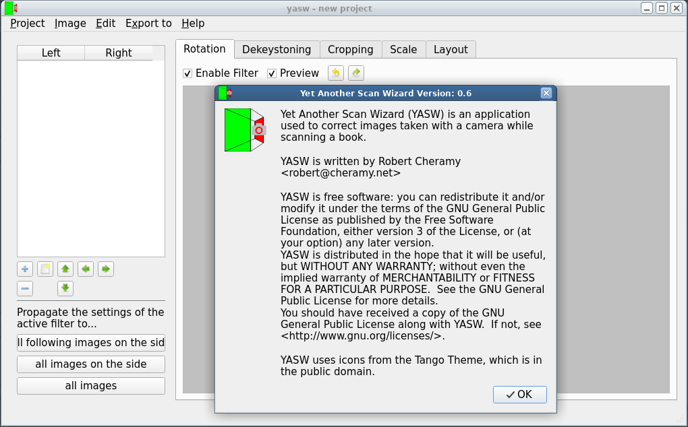

# YASW



## Intro

YASW (Yet Another Scan Wizard) is an application used to correct images taken
with a camera while scanning a book. See http://http://www.diybookscanner.org/
for full information on how to scan with digital cameras.

## LICENSE

YASW is licenced under GPLv3.
```
 => See LICENSE for details.
```

yasw uses icons fron the Tango Theme, which are in the public domain.
```
 => See src/icons/tango-icon-theme/copyright.txt for details:
    The icons in this folder are taken from the Tango Icon Theme Version 0.8.90.
    It can be downloaded from http://tango.freedesktop.org/releases

   The icons in the Tango Icon Theme are released under the Public Domain, as stated by the COPYING file in the original tarball:
   "The icons in this repository are herefore released into the Public Domain."
```

## Links

You can download YASW from https://sourceforge.net/projects/yascanw/
